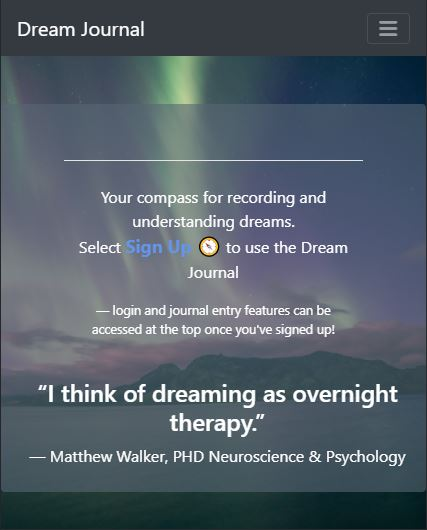

# Dream-Journal

This application assists a user in recording their dreams

## Collaborators:

Dani Reinholz, Wesley Bryant, Alan M Do, Jonny Martin

## Table of Contents

- [Technologies Used](#technologies-used)
- [User Story](#user-story)
- [New Tech Used by Group](#new-tech-used-by-group)
- [Link to live site](#link-to-live-site)
- [Milestones](#milestones)
- [Challenges](#challenges)
- [Future Development](#future-development)
- [Slides Deck](#slides-deck)

## Technologies Used

- HTML
- CSS
- Bootstrap
- JavaScript
- Express
- Sequelize
- Passport
- Moment.js
- Bcrypt
- Dotenv
- Cookie-Parser

## User Story

1. As a User, I want a secure way to record and track my dreams over time to see if there are any patterns or mysteries revealed.
2. When I click Add Journal Entry I would like to be prompted with questions like how I'm feeling, the title of the dream, and place to enter a full description.
3. When I submit an entry I would like for a date tag to be added along with the title and emoji to past entries for later reference.
4. When I click on a past journal entry I would like to see the full dream details.

## New Tech Used by Group

- Cloudinary for save and using large images
- https://www.canva.com/ for color pallette in deciding page styling

## Link to live site

https://frozen-atoll-87689.herokuapp.com/

## Milestones

1. Dani established CSS styling, routed emojis, captured and converted timestamps, added hamburger menu display, added favicon.
2. Wesley wrote the initial front end display for emoji selection and adding edit function to journal post.
3. Alan added font and styling to laptop, tablet, and mobile display.
4. Jonny added styling including the dream on button for journal entry submissions.

## Challenges

- Capturing / converting timestamps
- Hamburger menu display
- Shortening code for favicon
- Mobile responsiveness on multiple screen sizes
- Edit function for journal post

## Future Development

- Dream interpretation library
- Add images to interpretation library
- Auto search database library based on dream entry
- Community forum where users can share dream entries and comment on others

## Slides Deck:

https://docs.google.com/presentation/d/1Ij4jv1d8xdbHxyuyYKg2ZEDAgE2HcYcn08e-4G9azLU/edit?usp=sharing
